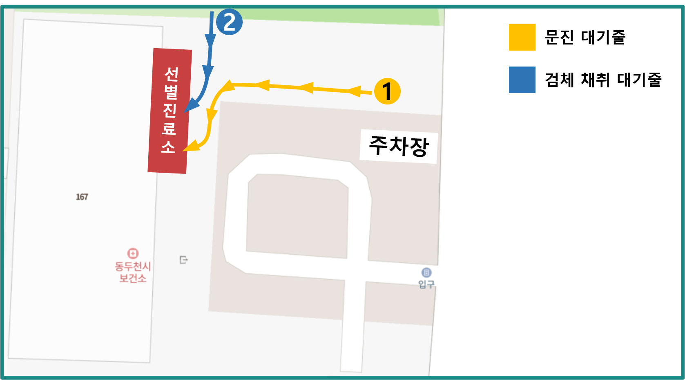

# 코로나19 선별진료 안내

## 기본정보 및 주의사항

### 기본정보

**운영시간** : 주중(월~금) 오전(09:00~11:30) / 오후(13:00~17:30), 토요일 09:30~11:30

> 종료시간 전에 대기인이 얼마나 있는지, 접촉자가 얼마나 발생했는지에 따라 통제가 이루어질 수 있습니다.
원활한 검사를 위해 미리 방문하시기를 권장합니다.

**장소** : 동두천시 보건소, 경기 동두천시 중앙로 167 동두천시보건소

### 주의사항

- 선별진료 필요물품을 꼭 챙겨주세요.

- 대기줄에서 노란색 안전테이프 뒤에 서 주세요. (사회적 거리두기)

- 운영시간에 맞추어 방문해주세요.

## 선별진료 필요물품

### 신분증

선별진료를 받기 위해서, **신분증**은 꼭 지참하셔야 합니다.  

주민등록증과 같은 신분증부터, 같은 역할을 할 수 있는 *운전면허증*, *여권*, *외국인등록증* 이나 *등본*,  
학생들의 경우 *학생증* 까지도 가능합니다.  

아직 신분증이 없는 아이의 경우, 보호자분께서 아이의 주민등록번호를 숙지하여주시면 됩니다.

> 간혹, 자차를 이용해 진료소로 오신 선생님께서는 자동차등록증 등을 제출해주시기도 합니다.

:::tip 실물 신분증이 아니어도 괜찮습니다.
신분증을 촬영한 사진만 있어도 검사가 가능해요!
:::

### 문자 또는 통화기록

:::danger 코로나19 확진자의 밀접접촉자이거나 동선이 겹치는 경우 등에 해당됩니다.

- 보건소 등에서 '검사를 받아야 한다.'는 요지의 문자 또는 연락을 받으신 경우,

- 중대본 등에서 '(기간)에 (장소)를 방문하신 분은 가까운 보건소에서 검사를 받으시기 바랍니다.'는 요지의
문자에 해당하시는 경우에는  

**받으신 문자 및 연락받은 통화기록**을 보여주셔야 합니다.
:::

## 선별진료 진행과정

1. **문진** : 차례가 되면 문진실에서 접수 및 문진을 실시합니다.

    :::warning 문진이 뭔가요?
    문진은, 코로나19 검사를 위하여 주요 정보를 여쭙고 확인하는 절차에요.  
    신분, 코로나19 검사 목적(왜 받는지), 기저 질환(가지고 계신 병) 등을 확인할 수 있습니다.
    :::

1. **검체 채취** : 코로나19 검사를 위한 검체를 채취합니다.

### 검사진행 중 주의사항

- 통제요원의 지시를 잘 따라주세요.

- 문진 또는 검사를 기다릴 때, 바닥에 표시된 테이프를 기준으로 서 주세요. (사회적 거리두기)

- 아이가 검사를 받는 경우, 문진 및 검사에 보호자가 동행할 수 있습니다.

## 검사비용

현재 보건소에서 실시하고 있는 코로나19 선별검사는 **100% 급여 검사**입니다.
따라서, 검사비용이 일체 발생하지 않습니다.  
자비로 부담하여 검사를 받는 **비급여 검사**는 실시하고 있지 *않으니*, 이 점 유의 바랍니다.

## 검사 확인증 및 결과지

코로나19 선별검사를 받았음을 증명하는 확인서,
혹은 검사 결과 양성 또는 음성임을 통지하는 결과지는 **발급하고 있지 않습니다.**

다만, 학생의 경우, 확인증을 지참하면 해당 증에 서명을 해 드릴 수 있습니다.

출국심사 등을 위해 서류 결과지가 필요하시다면,
민간병원을 방문하시어 검사를 받으시기 바랍니다.

:::details 동두천 근처 선별진료 가능 민간병원
동두천 내에는 코로나19 검사를 하는 민간병원이 없습니다. 다음 병원들을 추천합니다 :

- 양주 예스병원, 경기 양주시 회정로 103, ☎ 031-825-5000

- 의정부 백병원, 경기 의정부시 금신로 322 의정부백병원, ☎ 031-856-8111

- 의정부 추병원, 경기 의정부시 평화로 650 추병원, ☎ 031-845-7777

:::
