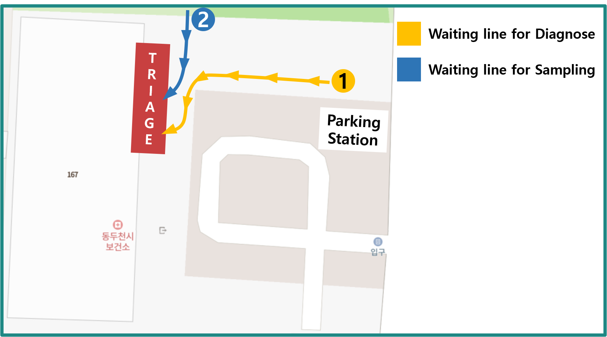

# Notice for COVID-19 Triage

## Basic information and Precautions

### Basic information

**Operating time** : Weekdays(MON~FRI) Morning(09:00~11:30) / Afternoon(13:00~17:30), Saturday 09:30~11:30

> Control can be achieved depending on how many people are waiting before the end time and how many contacts have occurred.
We recommend that you visit in advance for a smooth examination.

**Location** : Dongducheon-si Health Care Center, 167, Jungang-ro, Dongducheon-si, Gyeonggi-do, Republic of Korea

### Precautions

- Please make sure to take the required items.

- Please stand behind the yellow safety tape in the queue. (Social distancing)

- Please visit in time for the operation.

## Required Items

### ID card

In order to receive COVID-19 test, you must bring your **ID card**.  

ID cards such as resident registration cards, *driver's license*, *passport*, *foreign registration card*, *Copy or Abstract of Certification of Resident Register*,  
For students, *student ID* is also available.

For a child who doesn't have an ID yet, we need the child's social security number.

> Sometimes, people who come to the center by car submit their car registration certificate.

:::tip It doesn't have to be a real card.
Just a picture of your ID card is also okay.
:::

### A Message or a log of contact

:::danger This applies to cases of close contact with COVID-19 confirmed patients or overlapping movements.

- If you receive a message or contact that said 'You have to take COVID-19 test' from the health care center, or the other institution,

- Or if you are included of a message or contact 'If you visit (Place) at (Interval), take COVID-19 test at nearest health care center',  

You need to show me **the text message you received or the log of contact.**
:::

## the Method of Triage

1. **Diagnose** : When it's your turn, you can register and get diagnose.

    :::warning What will I do?
    While diagnose, we will check some basic infromation for COVID-19 test.  
    We can check your ID, the purpose of COVID-19 test(why you received it), and the underlying disease(diseases you have), etc.
    :::

    :::details What exactly is an 'Underlying disease'?
    Underlying diseases are some diseases that cause other diseases. It can be some conditions that you have at the diagnose, or also can any diseases that you have usually.  
    It includes *headache, sore throat, fever, diabetes, heart disease, obesity, cancer, and kidney disease*.
    :::

1. **Sampling** : Take some samples for COVID-19 test.

### Inspection In Progress Precautions

- Please follow the instructions.

- When you wait for Diagnose or Sampling, keep stand behind the yellow safety line. (Social distancing)

- If you need, your guardian can accompany you to Diagnose or Sampling.

## Costs

The current Covid-19 test conducted by the health center is a **100% payroll test**.
Therefore, no inspection costs are incurred.  
Please note that **non-payment inspection**, which is paid at your own expense, is not being carried out.

## Verification documents

**There are no verification documents** that the COVID-19 test has been carried out,
or a result sheet notifying the test result that it is positive or negative.

:::details How can I check the result of test?
We only service the result of test via text message.
:::

However, for students, we can sign the certificate if you bring it with you.

If you need the document results for departure inspection,
please visit a private hospital for inspection.

:::details Private hospitals capable of COVID-19 testing:
There is no private hospital in Dongducheon that conducts COVID-19 test. I recommend the following hospitals:

- Yangju "Yes" hospital, 103, Hoejeong-ro, Yangju-si, Gyeonggi-do, Republic of Korea, ☎ 031-825-5000

- Uijeongbu "Baek" hospital, 322, Geumsin-ro, Uijeongbu-si, Gyeonggi-do, Republic of Korea, ☎ 031-856-8111

- Uijeongbu "Choo" hospital, 650, Pyeonghwa-ro, Uijeongbu-si, Gyeonggi-do, Republic of Korea, ☎ 031-845-7777

:::
