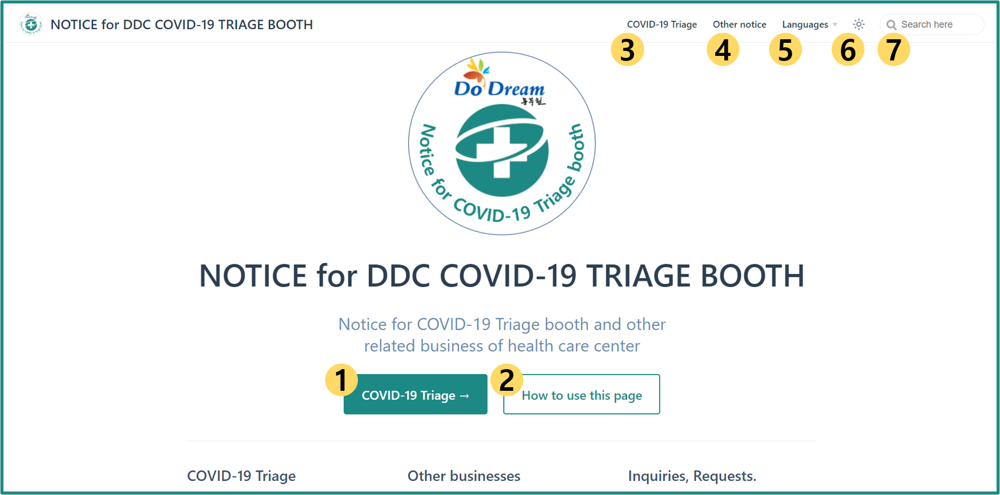

# 안내페이지 이용방법

안녕하세요, 동두천시보건소 선별진료소 지원팀입니다.  
이 페이지는 코로나19 대응기간 동안의 선별진료소 및 보건소 일반업무와 관련된 공지사항을 안내드리기 위해 만들어졌습니다.  

아래 내용을 참고해 어디서 어떤 정보를 확인할 수 있는지 둘러보세요 :smiley:

## 홈 화면 레이아웃

[홈 화면](../)은 다음과 같이 구성되어 있어요 :

1. `코로나19 선별검사 안내` 버튼을 눌러 선별검사와 관련 안내페이지로 이동하세요.

1. `페이지 이용`을 눌러 가이드 페이지(현재 페이지)로 이동하세요.

1. 우측 상단 `코로나19 선별진료` 버튼을 눌러 선별검사와 관련 안내페이지로 이동하세요.

    - 1번과 같은 메뉴에요.

1. 우측 상단 `기타 안내` 버튼을 눌러 선별검사 외 일반업무 안내페이지로 이동하세요.

1. 우측 상단 `해 표시`를 눌러 다크모드로 전환할 수 있어요.

1. 우측 상단 `검색 박스`에서 필요한 정보를 검색할 수 있어요.

## 안내 목록

이 안내페이지는 다음과 같은 사항들을 안내드리고 있어요:

- [코로나19 선별진료 관련 안내사항](../covid-19/) `준비물` `검사방법` `운영시간` `검사 소요시간`

- [기타 일반업무 안내사항](../other/) `일반사항`

  - 보건소 본관 업무 `보건증` `구강 보건사업` `각종 대여사업`

  - 보건소 별관 업무 `치매안심센터`
