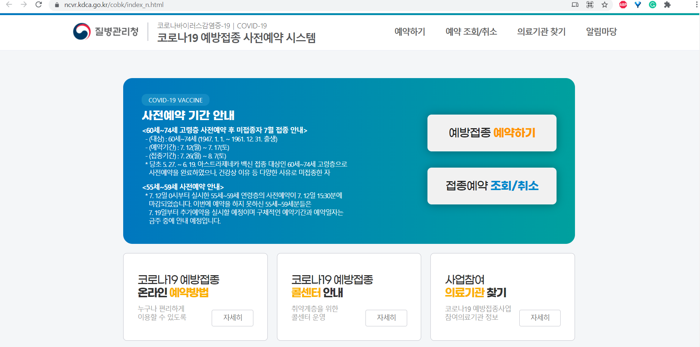

# COVID-19 VACCINE

## Advance booking

If you're eligible for the Covid-19 vaccine,
You can make a reservation in advance using the following methods:  

1. Calling to ☎1339

1. Calling to ☎031-860-2707~8

1. Making a reservation by Online

:::warning How can I know am I eligible or not?
The vaccination is determined by the government mainly based on the year of birth.
And the criteria of vaccination will be announced through the media such as the news. Please note it.  

There is no announcing by text message, except someone who did a reservation before and delayed it.
:::

:::danger Can I make a reservation at the health care center?
**No, you can't.** At the health care center, reservations for vaccination, such as writing documents, are not carried out separately.  
If making a reservation online is too hard, come to the health care center with your ID card and phone in your name.
We can help with the 'Online reservation'.  

If your cell phone is not your name, or you want to make a reservation by proxy,
there may be restrictions.
:::

### Book online

1. Search 'Corona 19 Pre-Reservation' on Naver, and access to
    [코로나19 사전예약 시스템](https://ncvr.kdca.go.kr/cobk/index_n.html)

    

1. Choose `예방접종 예약하기`

1. Enter the required information, and proceed with the self-certification.

1. Choose the date and location when and where you want to take the vaccine.

1. Choose the hospital and desired time you want.

1. Choose `예약 완료` for complete making a reservation.

1. Go to the hospital you choose at the time you choose.

## Reservation for Remaining Vaccines

> [Official briefing](https://www.korea.kr/news/policyNewsView.do?newsId=148887958)

### How to book

1. Use the app or browser for booking the remaining vaccines.

    - Search "잔여백신" on NAVER or NAVER MAP

    - Select the "잔여백신" tab on the Kakao Talk Bottom Shop (#) tab

    - Search "잔여백신" or select "잔여백신 실시간 예약" on KAKAO MAP

1. After selecting the consignment medical institution where the remaining vaccine occurred, book it.

### Set up Notifications

If you fail to make a reservation, you can set up the notification.
You can 'apply for notification' on the remaining vaccine inquiry screen after selecting the inoculation institution.  
Notifications can be set up for up to 5 consignment medical institutions.
