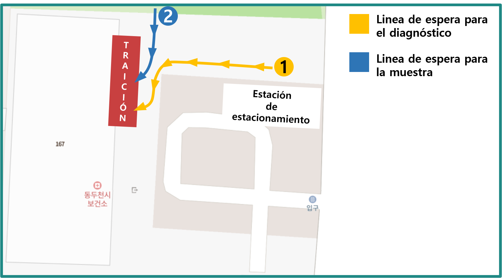

# Comunicación para el aborto COVID-19

## Información básica y precauciones

### Información básica

**Tiempo de operación** : Días de semana (MON~FRI) Buenos días(09:00 -11:30) / Almuerzo(13:00 -17:30), sábado 09:30 -11:30

> Se puede lograr el control dependiendo de cuántas personas están esperando antes del final del tiempo y de cuántos contactos se han producido.
Le recomendamos que se visite por adelantado para un examen regular.

**¡Localización!** : Centro de Cuidados de Salud Dongducheon-si, 167, Jungang-ro, Dongducheon-si, Gyeonggi-do, República de Corea

> `eng address` Dongducheon-si Health Care Center, 167, Jungang-ro, Dongducheon-si, Gyeonggi-do, Republic of Korea

### Cuidado

- Por favor, asegúrate de tomar los artículos necesarios.

- Por favor, póngase detrás de la cinta amarilla de seguridad en la fila. (Distanciamiento social)

- Por favor, visite a tiempo para la operación.

## Punto necesario

### Tarjeta de Identificación

Para recibir el examen COVID-19, debe llevar su tarjeta **ID**.  

tarjetas de identificación, como tarjetas de registro residencial, *licencia de conducir*, *passaporte*, *carta de registro extranjera*, *Copia o Abstracto de la certificación del registro de residentes*,  
Para los estudiantes, también está disponible una identificación de estudiante.

Para un niño que aún no tiene identificación, necesitamos el número de seguridad social del niño.

> A veces, las personas que vienen al centro en auto presentan sus certificados de registro de auto.

:::tip No tiene que ser una tarjeta de verdad.
Una foto de tu tarjeta de identificación también está bien.
:::

### Un mensaje o un registro de contacto

:::danger Esto se aplica a casos de contacto estrecho con pacientes confirmados por COVID-19 o de sobrelazos de movimientos.

- Si recibe un mensaje o contacto que diga "Tienes que hacer el examen COVID-19" del centro de salud, o de la otra institución,

- O si está incluido en un mensaje o en el contacto 'Si visita (Plaza) en (Interval), haga el examen COVID-19 en el centro de salud más cercano',  

Tienes que mostrarme **el mensaje de texto que recibiste o el registro de contacto.**
:::

## el Método de Triage

1. **Diagnosticar** : Cuando te toca, puedes registrarte y ser diagnosticado.

  :::warning ¿Qué voy a hacer?
  Mientras diagnostiquemos, comprobaremos algunas información básica para el test COVID-19.  
  Podemos comprobar su identificación, el propósito del examen COVID-19 (por qué lo recibió), y la enfermedad subyacente (perturbações que tienen), etc., etc.
  :::

  :::details ¿Qué es exactamente una "enfermedad subyacente"?
  Las enfermedades subyacentes son algunas que causan otras enfermedades. Puede ser algunas enfermedades que tienen en el diagnóstico, o también cualquier enfermedad que suele tener.  
  Incluye *dolores de cabeza, dolor de garganta, fiebre, diabetes, enfermedades cardíacas, obesidad, cáncer y enfermedades renales*.
  :::

1. **La muestra** : Toma algunas muestras para el examen COVID-19.

### Inspección en curso Prevenciones

- Por favor sigan las instrucciones.

- Cuando esperes a Diagnosar o a Sampling, mantenerte detrás de la línea de seguridad amarilla. (Distanciamiento social)

- Si lo necesitas, tu tutor puede acompañarte a diagnosticar o a tomar muestras.

## Costes

El examen actual Covid-19 realizado por el centro de salud es un examen de paga **100%**.
Por lo tanto, no se sufre ningún coste de inspección.  
Por favor, no se haga una inspección de no pago**, que se paga a sus propias expensas.

## Documentos de verificación

**No hay documentos de verificación** de que se haya realizado el test COVID-19,
o una hoja de resultados que notifique al resultado del examen que es positivo o negativo.

:::details ¿Cómo puedo comprobar el resultado del examen?
Sólo servimos el resultado del examen por mensaje de texto.
:::

Sin embargo, para los estudiantes, podemos firmar el certificado si lo traes contigo.

Si necesita los resultados del documento para inspección de partida,
por favor visite un hospital privado para inspección.

:::details Hospitales privados capaces de hacer pruebas COVID-19:
No hay ningún hospital privado en Dongducheon que lleve a cabo el examen COVID-19. Recomiendo los siguientes hospitales:

- El hospital Yangju "Sí", 103, Hoejeong-ro, Yangju-si, Gyeonggi-do, República de Corea, ☎ 031-825-5000

  > `eng` Yangju "Yes" hospital, 103, Hoejeong-ro, Yangju-si, Gyeonggi-do, Republic of Korea

- El hospital de Uijeongbu "Baek", 322, Geumsin-ro, Uijeongbu-si, Gyeonggi-do, República de Corea, ☎ 031-856-8111

  > `eng` Uijeongbu "Baek" hospital, 322, Geumsin-ro, Uijeongbu-si, Gyeonggi-do, Republic of Korea

- El hospital de Uijeongbu "Choo", 650, Pyeonghwa-ro, Uijeongbu-si, Gyeonggi-do, República de Corea, ☎ 031-845-7777

  > `eng` Uijeongbu "Choo" hospital, 650, Pyeonghwa-ro, Uijeongbu-si, Gyeonggi-do, Republic of Korea

:::
