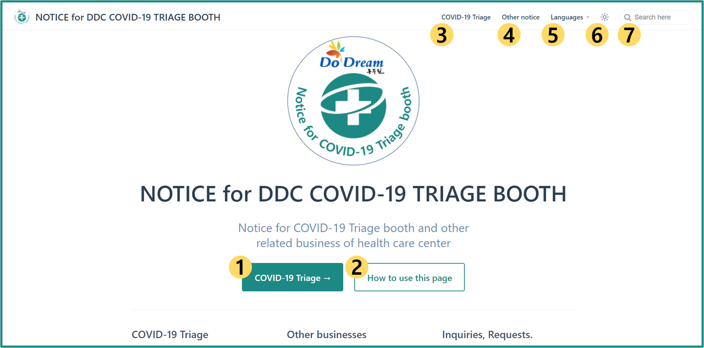

# Introduction

Hello, this is Triage support team of Dongducheon City Health Center Center.  
This page is created to inform you of the public notice related to the general affairs of triage and health centers during the Covid-19 response period.

See below to see where and what information you can find :smiley:

## Layouts of Home

The layouts of [Home](../) is like this :

1. Press the `COVID-19 Triage` button to go to the related information page.

1. Press the `How to use this page` button to go guide page(this page).

1. Press the `COVID-19 Triage` button at the right top to go to the related information page.

    - It's the same button as button number 1.

1. Press the `Other notice` button at the right top to go to the general business information page other than triage.

1. Press the `Sun mark` at the right top, you can change the theme to Dark-mode.

1. Via the `Languages` button at the right top, you can choose another language.

1. By the `Search Box` at the right top, you can find some information on this page.

## List of Notice

This page provides following informations :

- [Notice for COVID-19 Triage(test)](../covid-19/) `Preparation`, `Inspection Method/Time`, `Operation Time`

- [Other general notice](../other/) `General thing`

  - @Main building `Health certification` `Oral-health business` `Various rental business`

  - @Annex `Dementia relief center`
