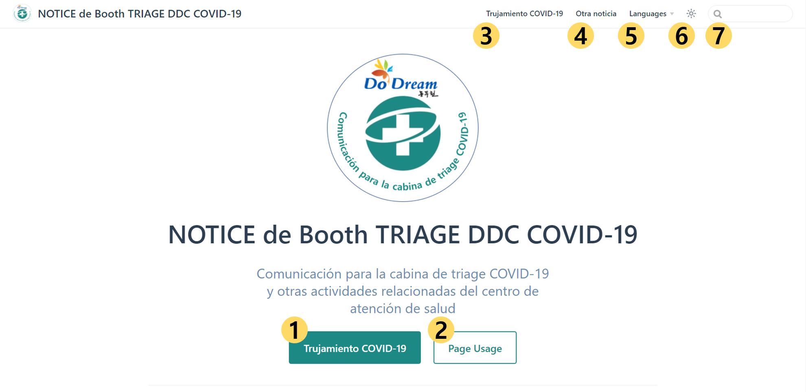

# Introducción

Hola, soy el equipo de apoyo Triage del Centro de Salud de Dongducheon.  
Esta página es creada para informarles de la noticia pública relativa a los asuntos generales de los centros de triage y salud durante el período de respuesta Covid-19.

Ver más abajo para ver dónde y qué información encontrará :smiley:

## Layouts of Home

Las [páginas principales](../) están las siguientes:

1. Presiona el botón `COVID-19 Triage` para ir a la página de información relacionada.

1. Presiona el botón `Cómo usar esta página` para ir a la página guía (esta página).

1. Presiona el botón `COVID-19 Triage` en la parte derecha para ir a la página de información relacionada.

    - Es el mismo botón que el número 1.

1. Presiona el botón `Otro aviso` en la parte superior derecha para ir a la página general de información comercial que no sea la triagía.

1. Presiona la `Marca del Sol` en la parte derecha, puede cambiar el tema a Modo Oscuro.

1. A través del botón `Languías` en la parte superior derecha, se puede elegir otra lengua.

1. En la `caja de búsqueda` en la parte superior derecha, se pueden encontrar algunas información en esta página.

## Lista de la noticia

Esta página ofrece las siguientes informaciones :

- [Comunicación para el tratamiento COVID-19(test)](../covid-19/) `Preparación`, `Método de inspección/Tiempo`, `Tiempo de operación`

- [Aviso a otros generales](../other/) `Lo general`

  - @El edificio principal `los negocios Oral-health` `Diversos negocios de alquiler`

  - @Anexo `Centro de La Demencia`

  - Trabajo temporalmente suspendido `Certificación sanitaria`
