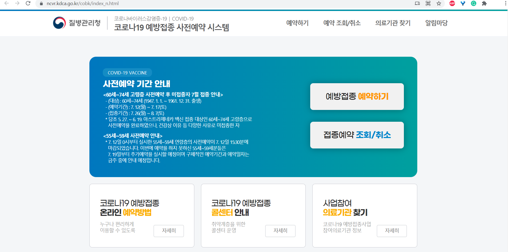

# 코로나19 백신

## 사전예약

코로나19 백신접종 대상자이신 경우,
다음의 방법을 통해 사전예약을 하실 수 있습니다:

1. ☎1339 로 전화

1. ☎031-860-2707~8 로 전화

1. 온라인으로 예약

:::warning 제가 코로나19 백신접종 대상자인지 어떻게 아나요?
백신접종 대상자의 여부는 주로 출생년도를 기준으로 정부에서 결정됩니다.
접종대상 기준은 뉴스 등의 언론을 통해 공지되오니, 이 점 유의 바랍니다.  

이전에 접종 대상자로 예약을 했지만, 미루어진 경우 등을 제외하고는 문자 등의 연락이 가지 않습니다.
:::

:::danger 보건소에서 백신접종 예약을 할 수 있나요?
**아니오**, 보건소에서는 예약 서류작성 등의 백신접종 예약업무가 별도로 진행되지 않습니다.  
만약 온라인 예약이 너무 어려우시다면, 신분증 및 본인명의 휴대전화와 함께 방문해주세요.
보건소에서 '온라인 예약' 절차를 도와드릴 수는 있습니다.  

지참하신 휴대전화가 본인명의 휴대전화가 아니거나, 대리예약을 원하시는 경우,
제한사항이 있을 수 있습니다.
:::

### 온라인으로 예약하기

1. 네이버에서 '코로나19 예방접종 사전예약'을 검색해,
    [코로나19 사전예약 시스템](https://ncvr.kdca.go.kr/cobk/index_n.html)으로 이동합니다.

    

1. `예방접종 예약하기`를 선택합니다.

1. 필요한 정보를 입력하고, 본인인증을 진행합니다.

1. 접종희망날짜를 선택하고, 접종희망지역을 선택합니다.

1. 접종가능한 병원들 중 원하는 병원, 원하는 시간대를 선택합니다.

1. `예약 완료`를 눌러 예약을 완료합니다.

1. 예약하신 시간에 해당 병원을 방문하여 백신을 접종받습니다.

## 잔여백신 예약

> [공식 브리핑](https://www.korea.kr/news/policyNewsView.do?newsId=148887958)

### 예약 방법

1. 잔여백신 예약이 가능한 앱 또는 브라우저를 이용합니다. 다음과 같은 방법이 가능합니다:

    - 네이버앱, 네이버지도앱에서 "잔여백신" 을 검색

    - 카카오톡 하단 샵(#) 탭에서 "잔여백신" 탭을 선택

    - 카카오맵에서 "잔여백신"을 검색하거나 검색창 밑 "잔여백신 실시간 예약"을 선택

1. 잔여백신이 발생한 위탁의료기관을 선택 후, 예약.

### 예약 불가시, 알림설정 방법

잔여백신 조회 화면에서, 접종기관 선택 후 '알림 신청'이 가능합니다.  
최대 5곳의 위탁의료기관까지 알림을 설정할 수 있습니다.
